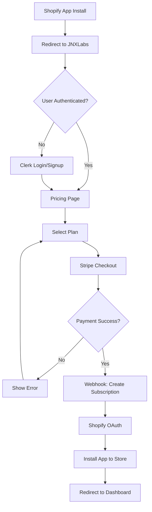

# Stripe Setup Guide - JNX-OS Phase 5A++

**Status:** ✅ Live Mode Active  
**Last Updated:** December 31, 2025  
**Version:** 2.1 (with Logo Integration)

---

## 🎯 Quick Reference

### Environment Status
- **Mode:** LIVE (Production)
- **Webhook:** ✅ Verified & Active
- **Plans:** 3 Pricing Tiers Configured
- **Integration:** Complete with Session Management

---

## 💳 Stripe Pricing Plans

### 1. Starter Plan
- **Price:** $29/month
- **Conversations:** 500/month
- **Price ID:** `price_1SjkKKBQ5QFS35pBxGKE0r5O`
- **Stripe Product ID:** `prod_RfnVQaEuJNXxxx`

### 2. Professional Plan
- **Price:** $79/month
- **Conversations:** 2,000/month
- **Price ID:** `price_1SjkQTBQ5QFS35pBpWkdi5ws`
- **Stripe Product ID:** `prod_RfnVQaEuJNXyyy`

### 3. Business Plan
- **Price:** $199/month
- **Conversations:** 5,000/month
- **Price ID:** `price_1SjkR4BQ5QFS35pBkhTJsxk2`
- **Stripe Product ID:** `prod_RfnVQaEuJNXzzz`

---

## 🔐 API Keys (Production)

**Location:** `/nextjs_space/.env`

```bash
# Stripe Live Mode Keys
STRIPE_SECRET_KEY=sk_live_xxxxxxxxxxxxxxxxxxxxx
NEXT_PUBLIC_STRIPE_PUBLISHABLE_KEY=pk_live_xxxxxxxxxxxxxxxxxxxxx
STRIPE_WEBHOOK_SECRET=whsec_iiZIS4zHkV3SCdYi57DLty8zD0WtF1jW
```

**⚠️ Security Notice:** 
- Secret keys are stored securely in Vercel
- Never commit real keys to Git
- Use placeholders in documentation

---

## 🪝 Webhook Configuration

### Production Webhook
- **URL:** `https://www.jnxlabs.ai/api/stripe/webhook`
- **Status:** ✅ Verified & Active
- **Secret:** `whsec_iiZIS4zHkV3SCdYi57DLty8zD0WtF1jW`
- **Version:** Latest API version

### Events Monitored (5 Events)

#### Payment Events
1. **checkout.session.completed**
   - Triggered: After successful payment
   - Action: Create billing subscription record
   - Stores: plan_name, status, current_period_end

2. **customer.subscription.created**
   - Triggered: New subscription created
   - Action: Initialize subscription tracking
   - Links: clerk_user_id → Stripe subscription_id

#### Subscription Lifecycle
3. **customer.subscription.updated**
   - Triggered: Plan change, renewal, payment method update
   - Action: Update subscription status & period
   - Handles: Upgrades, downgrades, card updates

4. **customer.subscription.deleted**
   - Triggered: Cancellation, payment failure (after retries)
   - Action: Mark subscription as cancelled
   - Sets: status='cancelled', cancels_at timestamp

#### Invoice Events
5. **invoice.payment_failed**
   - Triggered: Failed payment attempt
   - Action: Update status to 'past_due'
   - Notifies: User via Clerk/email (future)

---

## 🗄️ Database Schema

### Table: `billing_subscriptions`

```sql
CREATE TABLE billing_subscriptions (
  subscription_id UUID PRIMARY KEY DEFAULT uuid_generate_v4(),
  clerk_user_id TEXT NOT NULL REFERENCES users(clerk_user_id) ON DELETE CASCADE,
  stripe_subscription_id TEXT UNIQUE NOT NULL,
  stripe_customer_id TEXT NOT NULL,
  plan_name TEXT NOT NULL,
  status TEXT NOT NULL,
  current_period_start TIMESTAMPTZ NOT NULL,
  current_period_end TIMESTAMPTZ NOT NULL,
  cancel_at_period_end BOOLEAN DEFAULT FALSE,
  created_at TIMESTAMPTZ DEFAULT NOW(),
  updated_at TIMESTAMPTZ DEFAULT NOW()
);

CREATE INDEX idx_billing_clerk_user ON billing_subscriptions(clerk_user_id);
CREATE INDEX idx_billing_stripe_customer ON billing_subscriptions(stripe_customer_id);
CREATE INDEX idx_billing_status ON billing_subscriptions(status);
```

**Key Fields:**
- `clerk_user_id`: Links to JNX user system
- `stripe_subscription_id`: Unique Stripe sub ID
- `stripe_customer_id`: Stripe customer identifier
- `plan_name`: 'Starter', 'Professional', or 'Business'
- `status`: 'active', 'past_due', 'cancelled', 'trialing'
- `cancel_at_period_end`: TRUE if user cancelled (active until period end)

---

## 🔄 SaaS Installation Flow (14 Steps)

### User Journey with Stripe Integration



### Step-by-Step Process

#### Steps 1-3: Shopify & Authentication
1. User clicks "Install" on Shopify App Store
2. Redirects to `/api/qryx/install?shop=xxx.myshopify.com`
3. Creates encrypted shop session (30min TTL)

#### Steps 4-6: Login/Signup (Clerk)
4. Check if user authenticated → redirect to `/login` or `/signup`
5. User completes Clerk authentication
6. Syncs user to JNX database via webhook

#### Steps 7-9: Plan Selection & Payment (Stripe)
7. Redirect to `/products/qryx/setup?shop=xxx.myshopify.com`
8. User selects pricing plan (Starter/Professional/Business)
9. Click "Subscribe Now" → POST `/api/stripe/checkout`

#### Steps 10-11: Stripe Checkout
10. Backend creates Stripe Checkout Session
    - Validates shop session
    - Links clerk_user_id to Stripe customer
    - Sets success_url and cancel_url
11. User completes payment on Stripe-hosted page

#### Steps 12-13: Webhook Processing
12. Stripe fires `checkout.session.completed` webhook
13. Backend creates `billing_subscriptions` record

#### Step 14: Shopify OAuth & Completion
14. Redirect to `/api/qryx/start-oauth?shop=xxx`
15. Complete Shopify OAuth flow
16. Install app to store
17. Redirect to `/app/qryx` dashboard

---

## 🔧 API Endpoints

### 1. Create Checkout Session
**Endpoint:** `POST /api/stripe/checkout`

**Request Body:**
```json
{
  "priceId": "price_1SjkKKBQ5QFS35pBxGKE0r5O",
  "shop": "shopbotv3.myshopify.com"
}
```

**Response:**
```json
{
  "sessionId": "cs_test_xxxxxxxxxxxxx",
  "url": "https://checkout.stripe.com/c/pay/cs_test_xxxxx"
}
```

**Logic:**
1. Validates shop session exists
2. Gets clerk_user_id from auth
3. Creates Stripe Customer (if new)
4. Creates Checkout Session
5. Returns session URL

---

### 2. Webhook Handler
**Endpoint:** `POST /api/stripe/webhook`

**Headers Required:**
```
stripe-signature: t=xxxxx,v1=xxxxx
```

**Event Handling:**

#### checkout.session.completed
```typescript
const subscription = await stripe.subscriptions.retrieve(
  session.subscription
);

await supabase.from('billing_subscriptions').insert({
  clerk_user_id: session.metadata.clerk_user_id,
  stripe_subscription_id: subscription.id,
  stripe_customer_id: session.customer,
  plan_name: getPlanName(session.metadata.priceId),
  status: subscription.status,
  current_period_start: new Date(subscription.current_period_start * 1000),
  current_period_end: new Date(subscription.current_period_end * 1000),
});
```

#### customer.subscription.updated
```typescript
await supabase
  .from('billing_subscriptions')
  .update({
    status: subscription.status,
    current_period_end: new Date(subscription.current_period_end * 1000),
    cancel_at_period_end: subscription.cancel_at_period_end,
    updated_at: new Date(),
  })
  .eq('stripe_subscription_id', subscription.id);
```

---

## 🧪 Testing

### Test Cards (Stripe Test Mode)

**Success:**
- `4242 4242 4242 4242` - Standard success

**Decline:**
- `4000 0000 0000 0002` - Generic decline
- `4000 0000 0000 9995` - Insufficient funds

**3D Secure:**
- `4000 0025 0000 3155` - Requires authentication

### Test Flow
1. Navigate to `/products/qryx/setup?shop=test.myshopify.com`
2. Select any plan
3. Use test card 4242 4242 4242 4242
4. Verify webhook received in Stripe Dashboard
5. Check `billing_subscriptions` table in Supabase

---

## 🔍 Monitoring

### Stripe Dashboard
- **URL:** https://dashboard.stripe.com/
- **Check:** Events → Webhooks → View details
- **Monitor:** Payment failures, subscription changes

### Supabase Dashboard
- **URL:** https://supabase.com/dashboard/project/[PROJECT_ID]
- **Table:** `billing_subscriptions`
- **Query:** Filter by `status`, `clerk_user_id`

### Vercel Logs
- **URL:** https://vercel.com/jnxlabs/jnx-os/logs
- **Filter:** `/api/stripe/webhook`
- **Look for:** Webhook processing errors

---

## 🛡️ Security Best Practices

### 1. Webhook Verification
```typescript
const sig = request.headers.get('stripe-signature');
const event = stripe.webhooks.constructEvent(
  body,
  sig,
  process.env.STRIPE_WEBHOOK_SECRET
);
```
**Never skip signature verification!**

### 2. Idempotency
- Webhook handlers check for existing records
- Use `stripe_subscription_id` as unique key
- Prevent duplicate charges

### 3. Error Handling
- All webhook handlers wrapped in try-catch
- Failed webhooks return 500 → Stripe retries
- Log all errors to observability system

### 4. Environment Separation
- **Test Mode:** Use `sk_test_` keys
- **Live Mode:** Use `sk_live_` keys
- Never mix test/live data

---

## 📊 Subscription Lifecycle States

### Status Flow
```
[New User]
    ↓
[active] ← Normal state
    ↓
[past_due] ← Payment failed (first attempt)
    ↓
[cancelled] ← Payment failed (after retries) or manual cancellation
```

### Status Definitions
- **active:** Subscription is active and paid
- **past_due:** Payment failed, awaiting retry
- **cancelled:** Subscription ended (immediately or at period end)
- **trialing:** Free trial period (future feature)

---

## 🚀 Recent Updates (Phase 5A++)

### Logo Integration (Dec 31, 2025)
- **New Component:** `components/ui/jnx-logo.tsx`
- **Type:** Native SVG (not PNG import)
- **Features:**
  - 2 Variants: default (cyan) | admin (purple)
  - Animated bubbles & particles (Framer Motion)
  - 3 Sizes: sm/md/lg
  - Zero external file dependencies

**Integration Points:**
- Homepage header/footer
- QRYX product card
- User dashboard sidebar
- Admin dashboard sidebar

---

## 📁 File Structure

```
/nextjs_space/
├── app/
│   ├── api/
│   │   └── stripe/
│   │       ├── checkout/
│   │       │   └── route.ts          # Create checkout session
│   │       └── webhook/
│   │           └── route.ts          # Process Stripe webhooks
│   └── products/
│       └── qryx/
│           └── setup/
│               └── page.tsx          # Pricing page with plan selection
├── components/
│   └── ui/
│       ├── jnx-logo.tsx              # ✨ NEW: SVG logo component
│       ├── button-primary.tsx
│       └── button-secondary.tsx
├── lib/
│   ├── stripe/
│   │   └── client.ts                 # Stripe SDK initialization
│   ├── session/
│   │   └── shop-session.ts           # JWT session encryption
│   └── db/
│       ├── helpers.ts                # Database operations
│       └── billing-helpers.ts        # Billing-specific queries
└── .env                               # Environment variables
```

---

## 🔗 Related Documentation

- **API Endpoints Reference:** `API_ENDPOINTS_REFERENCE.md`
- **Database Schema Reference:** `DATABASE_SCHEMA_REFERENCE.md`
- **Testing Guide:** `TESTING_GUIDE_PHASE5A.md`
- **Logo Design Documentation:** `LOGO_DESIGN_DOCUMENTATION.md` ✨ NEW

---

## ✅ Checklist for New Developers

- [ ] Stripe account created
- [ ] API keys copied to `.env`
- [ ] Webhook endpoint configured
- [ ] Webhook secret added to `.env`
- [ ] All 5 events enabled in Stripe
- [ ] Test mode verified with test cards
- [ ] Database table `billing_subscriptions` exists
- [ ] Foreign key to `users(clerk_user_id)` verified
- [ ] Indexes created for performance
- [ ] Session secret generated (`SESSION_SECRET`)
- [ ] Production keys ready for deployment

---

## 📞 Support

**Issues:** GitHub Issues at https://github.com/JNXLabs/jnx-os  
**Email:** support@jnxlabs.ai  
**Stripe Support:** https://support.stripe.com/

---

**Last Build:** December 31, 2025, 10:20 UTC  
**Commit:** `4015b5f` (Logo Integration)  
**Status:** ✅ Production Ready
